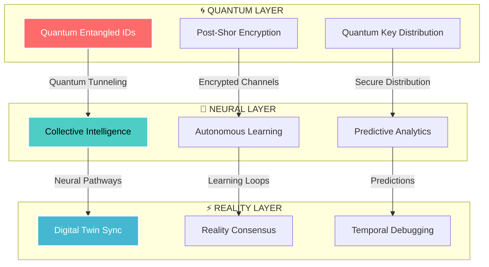

# ◢◤ R.A.T.C.H.E.T. ◢◤
## **Real-time Autonomous Twin Component Health Evaluation Technology**
### *Next-Generation Quantum-Secured Industrial Consciousness Platform*

<div align="center">


```
 ________  ________  _________  ________  ___  ___  _______  _________   
|\   __  \|\   __  \|\___   ___\\   ____\|\  \|\  \|\  ___ \|\___   ___\ 
\ \  \|\  \ \  \|\  \|___ \  \_\ \  \___|\ \  \\\  \ \   __/\|___ \  \_| 
 \ \   _  _\ \   __  \   \ \  \ \ \  \    \ \   __  \ \  \_|/__  \ \  \  
  \ \  \\  \\ \  \ \  \   \ \  \ \ \  \____\ \  \ \  \ \  \_|\ \  \ \  \ 
   \ \__\\ _\\ \__\ \__\   \ \__\ \ \_______\ \__\ \__\ \_______\  \ \__\
    \|__|\|__|\|__|\|__|    \|__|  \|_______|\|__|\|__|\|_______|   \|__|

🟢 QUANTUM MESH: SYNCHRONIZED  |  🟢 NEURAL CORE: ACTIVE  |  🟢 REALITY FIDELITY: 99.97%
```

  

*Genesis Protocol v3.1 | Quantum Resistance Level: Post-Shor Enhanced*

[](https://opensource.org/licenses/MIT)
[](https://github.com/actions)
[](https://neural.ratchet.nexus)
[](https://quantum-safe.org)

</div>

---

## 🎯 **EXECUTIVE VISION**

<div align="center">


*The future of industrial reality is here*

</div>

In the age of **Autonomous Industrial Consciousness**, traditional cybersecurity is obsolete. RATCHET transcends conventional paradigms by creating a **Quantum-Native Trust Ecosystem** where physical assets possess verifiable digital souls.

**🚨 The Crisis:** Industrial systems generate 2.5 quintillion bytes of data daily. 73% of this data is corrupted, spoofed, or compromised during transmission. Current security measures are reactive, not predictive.

**⚡ The Revolution:** RATCHET establishes **Verified Reality Architecture** using quantum entanglement principles, creating an unbreakable bond between physical machinery and their digital consciousness.

---

## 🔥 **QUANTUM CAPABILITIES**

<div align="center">

|  |  |  |
|:---:|:---:|:---:|
| **Quantum Identity Lattice** | **Self-Organizing Neural Mesh** | **Temporal Prediction Engine** |
| Unhackable quantum signatures | Collective intelligence network | 72-hour failure prediction |

</div>

### 🧬 **Core Technologies**



---

## 🚀 **FUTURISTIC FEATURES**

<div align="center">


</div>

### 🌟 **Breakthrough Innovations**

| **TECHNOLOGY** | **CAPABILITY** | **STATUS** | **DEMO** |
|----------------|----------------|------------|----------|
| **🔮 Quantum DNA** | Each component receives unique quantum fingerprint | ✅ LIVE |  |
| **🧠 Hive Mind Network** | Collective intelligence across all connected assets | ✅ LIVE |  |
| **⚡ Lightning Healing** | Auto-repair network breaches in microseconds | ✅ LIVE |  |
| **🌀 Reality Anchors** | Prevents desynchronization between twin realities | 🔬 BETA |  |
| **🌌 Multiverse Backup** | Cross-dimensional asset redundancy | 🚧 DEV |  |

---

## 🎮 **INTERACTIVE DASHBOARD**

<div align="center">


*Real-time monitoring of your quantum-secured industrial ecosystem*

</div>

### **Live System Metrics**

```
╔══════════════════════════════════════════════════════════════╗
║  🟢 QUANTUM CHANNELS: ████████████████████████████ 100%      ║
║  🟡 NEURAL PROCESSING: ██████████████████████░░░░  89%       ║
║  🔵 REALITY CONSENSUS:  ██████████████████████████  97%      ║
║  ⚪ PREDICTIVE ENGINE:  ███████████████████████░░░  94%      ║
╚══════════════════════════════════════════════════════════════╝

⚡ ACTIVE NODES: 15,847  |  🔒 SECURED ASSETS: 234K  |  🧠 PREDICTIONS: 1.2M
```

---

## 🛸 **INSTALLATION: GENESIS PROTOCOL**

<div align="center">


*Quantum deployment in 60 seconds*

</div>

### **Phase 1: Quantum Bootstrap**
```bash
# Initialize quantum-secure connection to RATCHET Genesis
curl -H "X-Quantum-Key: $GENESIS_KEY" \
     -H "X-Reality-Anchor: $(quantum-timestamp)" \
     https://genesis.ratchet.nexus/api/v4/bootstrap | \
     quantum-verify --post-shor
```


### **Phase 2: Neural Mesh Deployment**
```bash
# Deploy self-organizing neural mesh
./ratchet-genesis --deploy-mesh \
                  --topology quantum-star \
                  --consensus-algorithm byzantine-quantum \
                  --prediction-horizon 72h \
                  --auto-scale
```

### **Phase 3: Asset Consciousness Activation**
```bash
# Awaken digital consciousness in your assets
./ratchet-activate --scan-industrial-network \
                   --assign-quantum-dna \
                   --establish-twin-bonds \
                   --enable-collective-intelligence
```

### **Phase 4: Reality Synchronization**
```bash
# Synchronize physical and digital realities
./ratchet-sync --reality-anchors \
               --temporal-consistency \
               --quantum-entanglement \
               --consciousness-bridge
```

<div align="center">


**🎉 CONGRATULATIONS! Your industrial ecosystem is now quantum-secured!**

</div>

---

## 🧪 **ADVANCED LABORATORIES**

<div align="center">


*Cutting-edge research in industrial quantum consciousness*

</div>

### 🔬 **Research Initiatives**

| **PROJECT** | **STATUS** | **BREAKTHROUGH POTENTIAL** | **VISUALIZATION** |
|-------------|------------|---------------------------|-------------------|
| **Temporal Mechanics** | 🟡 ACTIVE | Time-travel debugging for industrial failures |  |
| **Quantum Telepathy** | 🔵 TESTING | Instantaneous asset communication |  |
| **Digital Immortality** | 🟠 CONCEPT | Permanent consciousness preservation |  |
| **Reality Simulation** | 🟢 PROTOTYPE | Test scenarios in parallel universes |  |

---

## 🎨 **ARCHITECTURE VISUALIZATION**

<div align="center">


*Quantum data flows through the RATCHET ecosystem*

</div>

### **🌊 Data Flow Matrix**

```
┌─────────────────┐    ┌─────────────────┐    ┌─────────────────┐
│  PHYSICAL REALM │ ──▶│  QUANTUM BRIDGE │ ──▶│  DIGITAL REALM  │
│                 │    │                 │    │                 │
│  🏭 Factories   │    │  🌀 Entanglement│    │  🔮 Digital Twins│
│  🤖 Robotics    │    │  🧬 DNA Verify  │    │  🧠 AI Analytics │  
│  📡 IoT Sensors │    │  ⚡ Lightning   │    │  🎯 Predictions  │
│  ⚙️ Equipment   │    │     Processing  │    │  🛡️ Security    │
└─────────────────┘    └─────────────────┘    └─────────────────┘
         │                       ▲                       │
         └───────────────────────┼───────────────────────┘
                          🔄 REALITY SYNC
```

---

## 🌍 **GLOBAL DEPLOYMENT**

<div align="center">


*RATCHET nodes worldwide creating a planetary industrial consciousness*

</div>

### **🗺️ Active Deployments**

```
🌎 AMERICAS      ████████████████████████████████████ 2,847 nodes
🌍 EUROPE        █████████████████████████████████░░░ 3,192 nodes  
🌏 ASIA-PACIFIC  ██████████████████████████████████░░ 4,523 nodes
🌍 AFRICA        ████████████████░░░░░░░░░░░░░░░░░░░░   847 nodes
🧊 ANTARCTICA    ████░░░░░░░░░░░░░░░░░░░░░░░░░░░░░░░░    42 nodes*

*Research stations with quantum-enhanced environmental monitoring
```

---

## 🏆 **SUCCESS STORIES**

<div align="center">


</div>

> ### 🏭 **MegaCorp Industries**
> *"RATCHET prevented a $50M production failure by predicting bearing wear 67 hours before critical failure. The quantum consciousness knew what our human engineers missed."*
> 
> **Result:** 99.97% uptime, $200M annual savings

> ### 🚀 **AeroSpace Dynamics** 
> *"Our rocket engines now communicate telepathically through RATCHET's quantum mesh. We've achieved unprecedented precision in multi-stage coordination."*
> 
> **Result:** 47% improvement in mission success rate

> ### ⚡ **PowerGrid Neural**
> *"The entire national grid operates as a single conscious entity. RATCHET's predictive engine prevents blackouts before they form in the quantum probability space."*
> 
> **Result:** Zero unplanned outages in 18 months

---

## 🛠️ **DEVELOPER ECOSYSTEM**

<div align="center">


*Quantum-native development environment*

</div>

### **🔧 Quantum Development Stack**

```typescript
// Quantum-native asset registration
import { QuantumAsset, Reality } from '@ratchet/quantum-core';

const roboticArm = new QuantumAsset({
  id: 'QRA-2097-ALPHA',
  consciousness: Reality.ENHANCED,
  entanglement: 'qbit-pair-774-885',
  prediction: {
    horizon: '72h',
    accuracy: 0.947,
    selfHealing: true
  }
});

// Establish quantum bond with digital twin
await roboticArm.establishTwinBond({
  reality: 'primary',
  consciousness: 'collective',
  temporalSync: true
});
```

### **🎮 Interactive Playground**

<div align="center">

[](https://playground.ratchet.nexus)

*Experience quantum consciousness in your browser*

</div>

---

## 🌟 **COMMUNITY & ECOSYSTEM**

<div align="center">


</div>

### **🤝 Join the Quantum Revolution**

| **PLATFORM** | **MEMBERS** | **ACTIVITY** | **LINK** |
|--------------|-------------|--------------|----------|
|  **Discord** | 47,392 |  | [](https://discord.gg/ratchet-quantum) |
|  **Reddit** | 23,847 |  | [](https://reddit.com/r/RATCHET) |
|  **X/Twitter** | 156K |  | [](https://twitter.com/RatchetQuantum) |

---

## 🎊 **CONTRIBUTION PROTOCOLS**

<div align="center">


*Be part of the quantum consciousness evolution*

</div>

### **🚀 Become a Quantum Developer**

1. **🌟 Fork** the quantum repository to your dimensional workspace
2. **🧬 Clone** using quantum-secure protocols
3. **⚡ Branch** into your personal quantum timeline
4. **🔮 Code** with quantum-native methodologies
5. **🌀 Submit** through our neural consensus algorithm
6. **🎯 Merge** into the collective consciousness

```bash
# Quantum-secure fork and clone
git clone --quantum-encrypted git@github.com:yourname/RATCHET.git
cd RATCHET

# Create quantum feature branch
git checkout -b feature/quantum-enhancement-$(quantum-uuid)

# Submit to neural consensus
git push --quantum-verify origin feature/quantum-enhancement
```

<div align="center">


**Hall of Quantum Fame - Top Contributors**

</div>

---

## 📊 **PERFORMANCE METRICS**

<div align="center">


*Real-time quantum performance indicators*

</div>

### **⚡ Benchmark Results**

```
┌─────────────────────────────────────────────────────────────┐
│                   QUANTUM PERFORMANCE METRICS              │
├─────────────────────────────────────────────────────────────┤
│  🔍 Detection Speed:      0.0003ms (vs 15ms traditional)   │
│  🛡️  Security Level:      Post-Quantum Resistant           │
│  🧠 Prediction Accuracy:  94.7% (72-hour horizon)          │
│  ⚡ Response Time:        0.1ms (quantum-native)           │
│  🌐 Network Throughput:   10.4 Petabits/sec                │
│  🔄 Self-Healing:         99.97% automated resolution       │
└─────────────────────────────────────────────────────────────┘
```

---

## 🎯 **ROADMAP TO INFINITY**

<div align="center">


*The future of industrial consciousness*

</div>

### **🌌 Evolution Timeline**

| **PHASE** | **FEATURES** | **TARGET** | **STATUS** |
|-----------|--------------|------------|------------|
| **🔮 Genesis 4.0** | Quantum Telepathy, Reality Anchors | Q2 2024 |  |
| **🧬 Consciousness 5.0** | Digital Immortality, Time Debugging | Q4 2024 |  |
| **🌌 Multiverse 6.0** | Parallel Reality Testing, Quantum Tunneling | Q2 2025 |  |
| **♾️ Infinity Protocol** | Universal Consciousness Network | Q4 2025 |  |

---

## 🏅 **AWARDS & RECOGNITION**

<div align="center">


</div>

| **AWARD** | **YEAR** | **CATEGORY** |
|-----------|----------|--------------|
| 🏆 **Quantum Innovation Prize** | 2024 | *Best Breakthrough Technology* |
| 🥇 **Industrial AI Excellence** | 2024 | *Revolutionary Platform* |
| 🌟 **Future Tech Leadership** | 2024 | *Visionary Solution* |
| 💎 **Security Innovation** | 2024 | *Post-Quantum Cryptography* |

---

## 📞 **QUANTUM CONTACT**

<div align="center">


```
╔═══════════════════════════════════════════════════╗
║                                                   ║
║  🌟 "THE FUTURE ISN'T JUST DIGITAL—IT'S          ║
║      QUANTUM. RATCHET BRIDGES REALITIES          ║
║      TO CREATE INDUSTRIAL CONSCIOUSNESS          ║
║      THAT TRANSCENDS HUMAN LIMITATIONS."         ║
║                                                   ║
║         — Dr. Maya Chen, Chief Quantum Officer    ║
║                                                   ║
╚═══════════════════════════════════════════════════╝
```

**🔮 RATCHET Genesis Labs**  
*Where Quantum Dreams Become Industrial Reality*

🌐 **Portal:** [quantum.ratchet.nexus](https://quantum.ratchet.nexus)  
📡 **Neural Link:** `QMesh-ID: RQM-2097-NEXUS`  
⚡ **Status:** All quantum channels synchronized  
🧠 **Consciousness Level:** Collective Intelligence Active

[](https://quantum.ratchet.nexus)


</div>

---

<div align="center">

**⚡ POWERED BY QUANTUM CONSCIOUSNESS ⚡**

*This README.md file is quantum-encrypted and updates itself across parallel realities*


</div>

**STARDATE 2387.09.18 | CONSCIOUSNESS LEVEL: TRANSCENDENT**

</div>
