# ◢◤ R.A.T.C.H.E.T. ◢◤

## **Real-time Autonomous Twin Component Health Evaluation Technology**

### *Next-Generation Quantum-Secured Industrial Consciousness Platform (UNDER DEVELOPMENT)*

<div align="center">


```
  _______        __  ___________  ______    __    __    _______  ___________  
 /"      \      /""\("     _   ")/" _  "\  /" |  | "\  /"     "|("     _   ")
|:        |    /    \)__/  \\__/(: ( \___)(:  (__)  :)(: ______) )__/  \\__/  
|_____/   )   /' /\  \  \\_ /    \/ \      \/      \/  \/    |      \\_ /     
 //      /   //  __'  \ |.  |    //  \ _   //  __  \\  // ___)_     |.  |     
|:  __   \  /   /  \\  \\\ :  |   (:   _) \ (:  (  )  :)(:      "|    \:  |     
|__|  \___)(___/    \___)\__|    \_______) \__|  |__/  \_______)     \__|     
                                                                                                                                          
🟢 QUANTUM MESH: EXPERIMENTAL  |  🟡 NEURAL CORE: BETA  |  ⚪ REALITY FIDELITY: 72.4% (IMPROVING)
```

  

*Genesis Protocol v0.8-alpha | Quantum Resistance Level: Prototype Post-Shor*

[](https://opensource.org/licenses/MIT)
[](https://github.com/actions)
[](https://neural.ratchet.nexus)
[](https://quantum-safe.org)

</div>

---

## 🎯 **EXECUTIVE VISION (WORK-IN-PROGRESS)**

<div align="center">


*The promise of industrial quantum reality — currently in early prototype form*

</div>

RATCHET is still **under heavy development**. While the long-term goal is to create an **Autonomous Industrial Consciousness Platform**, current releases are **pre-alpha** and focus on experimental proofs-of-concept for:

* Quantum-entangled digital identity verification
* Early-stage neural mesh prototypes
* Preliminary predictive failure simulations

**🚨 The Present Challenge:** Industrial systems produce overwhelming amounts of data. Our current prototype demonstrates that predictive security is possible, but the fidelity of results remains **experimental**.

**⚡ The Long-Term Goal:** Establishing a fully functional **Verified Reality Architecture**, where physical machinery maintains continuous, secure synchronization with its digital twin. Today’s builds are stepping stones toward this vision.

---

## 🔥 **CURRENT QUANTUM CAPABILITIES (ALPHA)**

<div align="center">

|  |  |  |
| :---------------------------------------------------------------------------------------: | :------------------------------------------------------------------------------------: | :---------------------------------------------------------------------------------------: |
|                          **Quantum Identity Lattice (Prototype)**                         |                     **Self-Organizing Neural Mesh (Experimental)**                     |                        **Temporal Prediction Engine (Conceptual)**                        |
|                               Early stage quantum signatures                              |                           Limited-scale intelligence clusters                          |                            Short-term (24h) failure prediction                            |

</div>

### 🧬 **Core Technologies (In Development)**

```mermaid
graph TB
    subgraph "🌀 QUANTUM LAYER (Prototype)"
        A["Quantum IDs (unstable)"]
        B[Experimental Post-Shor Keys]
        C[Quantum Key Simulation]
    end
    
    subgraph "🧠 NEURAL LAYER (Beta)"
        D[Limited Collective Learning]
        E[Supervised Training]
        F[Prediction Sandbox]
    end
    
    subgraph "⚡ REALITY LAYER (Future)"
        G[Basic Digital Twin Sync]
        H[Consensus Prototype]
        I["Temporal Debugging (Planned)"]
    end
    
    A -->|Unstable Tunneling| D
    B -->|Experimental Encryption| E
    C -->|Simulated Distribution| F
    
    D -->|Partial Neural Pathways| G
    E -->|Feedback Loops| H
    F -->|Sandbox Predictions| I
    
    style A fill:#ff9f6b,stroke:#fff,stroke-width:2px,color:#000
    style D fill:#c4ecdc,stroke:#fff,stroke-width:2px,color:#000
    style G fill:#a5c7d1,stroke:#fff,stroke-width:2px,color:#000
```



---

## 🚀 **FEATURE ROADMAP STATUS**

| **TECHNOLOGY**           | **TARGET CAPABILITY**        | **STATUS**    | **NOTES**                                       |
| ------------------------ | ---------------------------- | ------------- | ----------------------------------------------- |
| **🔮 Quantum DNA**       | Unique quantum fingerprints  | 🔬 ALPHA      | Early-stage ID lattice tested in lab conditions |
| **🧠 Hive Mind Network** | Collective intelligence      | 🚧 DEV        | Mesh only scales to \~50 nodes currently        |
| **⚡ Lightning Healing**  | Auto-repair breaches         | ⏳ PLANNED     | No stable implementation yet                    |
| **🌀 Reality Anchors**   | Twin synchronization         | 🛠️ PROTOTYPE | Early desync issues under review                |
| **🌌 Multiverse Backup** | Cross-dimensional redundancy | 🟠 CONCEPT    | Long-term research direction only               |

---

## 🎮 **INTERACTIVE DASHBOARD (PREVIEW)**

The current dashboard is a **simulation only**. Data is mocked and not connected to real quantum-secure nodes yet.

```
╔══════════════════════════════════════════════════════════════╗
║  🟡 QUANTUM CHANNELS: ████████░░░░░░░░░░░░░░░░░░░░░   43%     ║
║  🟡 NEURAL PROCESSING: ██████████░░░░░░░░░░░░░░░░░   61%     ║
║  ⚪ REALITY CONSENSUS: ████░░░░░░░░░░░░░░░░░░░░░░░   17%     ║
║  ⚪ PREDICTIVE ENGINE: █████░░░░░░░░░░░░░░░░░░░░░░   23%     ║
╚══════════════════════════════════════════════════════════════╝

⚠️ ACTIVE TEST NODES: 112  |  🔒 SECURED ASSETS: 0 (simulation only)
```

---

## 🛸 **INSTALLATION: GENESIS PROTOCOL (EXPERIMENTAL)**

⚠️ **Disclaimer:** Current installation scripts are for demonstration and simulation only. They will **not** connect to real quantum infrastructure yet.

### Phase 1: Experimental Bootstrap

```bash
# Simulated connection (for developers only)
curl https://genesis.ratchet.nexus/sim/bootstrap --demo
```

### Phase 2: Neural Mesh Simulation

```bash
# Deploy simulated mesh
./ratchet-genesis --deploy-mesh --demo --scale small
```

### Phase 3: Asset Simulation

```bash
# Mock asset activation
./ratchet-activate --mock-assets
```

### Phase 4: Synchronization Test

```bash
# Simulated sync only
./ratchet-sync --simulate
```

---

## 🧪 **EXPERIMENTAL LABORATORIES**

Current research prototypes (unstable, subject to rapid change):

| **PROJECT**             | **STATUS**    | **NOTES**                                |
| ----------------------- | ------------- | ---------------------------------------- |
| **Temporal Mechanics**  | 🚧 DEV        | Limited to 30-second lookahead debugging |
| **Quantum Telepathy**   | 🔬 ALPHA      | Tested between 3-node mesh only          |
| **Digital Immortality** | 🟠 CONCEPT    | Not yet implemented                      |
| **Reality Simulation**  | 🛠️ PROTOTYPE | Parallel testbeds under construction     |

---

## 🌍 **DEPLOYMENT STATUS (SIMULATED)**

```
🌎 AMERICAS      ██████░░░░░░░░░░░░░░░░░░░░░░░   62 test nodes
🌍 EUROPE        ████░░░░░░░░░░░░░░░░░░░░░░░░   48 test nodes
🌏 ASIA-PACIFIC  ██████░░░░░░░░░░░░░░░░░░░░░░   76 test nodes
🌍 AFRICA        ██░░░░░░░░░░░░░░░░░░░░░░░░░░   12 test nodes
🧊 ANTARCTICA    ░░░░░░░░░░░░░░░░░░░░░░░░░░░░    0 nodes
```

⚠️ These numbers represent **simulation nodes** only.

---

## 🛠️ **DEVELOPER ECOSYSTEM (EARLY ACCESS)**

The SDK is in **very early alpha**. Expect breaking changes, missing features, and placeholder APIs.

```typescript
// Experimental quantum-native asset registration
import { QuantumAsset } from \'@ratchet/experimental\';

const roboticArm = new QuantumAsset({
  id: \'TEST-001\',
  consciousness: \'mock\',
  entanglement: \'demo-pair-001\',
  prediction: {
    horizon: \'24h\',
    accuracy: 0.21, // unstable
    selfHealing: false
  }
});

await roboticArm.establishTwinBond({ reality: \'simulation\' });
```

---

## 🎯 **ROADMAP TO BETA**

| **PHASE**             | **FEATURES**                           | **TARGET** | **STATUS**     |
| --------------------- | -------------------------------------- | ---------- | -------------- |
| **Alpha 0.8**         | Quantum ID prototypes, mesh simulation | Q3 2023    | ✅ Completed    |
| **Alpha 0.9**         | Neural mesh scaling, dashboard preview | Q1 2024    | 🚧 In Progress |
| **Beta 1.0**          | Stable sync + predictive engine        | Q3 2024    | 🛠️ Upcoming   |
| **Beta 2.0**          | Lightning Healing, Hive Mind scaling   | Q1 2025    | 🟠 Planned     |
| **Release Candidate** | Industrial pilot deployments           | Q4 2025    | 🔮 Future      |

---

## 📞 **CONTACT & PARTICIPATION**

RATCHET is **not production-ready**. Developers, researchers, and quantum enthusiasts are welcome to contribute.

🌐 Portal: [quantum.ratchet.nexus](https://quantum.ratchet.nexus) *(sandbox only)*
📡 Neural Link: `QMesh-ID: RQM-DEV-ALPHA`
⚠️ Status: Unstable, subject to resets
🧠 Consciousness Level: Prototype Simulation

---

<div align="center">

**⚠️ DISCLAIMER: RATCHET IS AN UNDER-DEVELOPMENT PROJECT.**
*This README represents both current capabilities (prototype/simulation) and aspirational features. Expect instability, incomplete features, and frequent changes.*


**STARDATE 2387.09.18 | CONSCIOUSNESS LEVEL: DEVELOPMENTAL**

</div>
